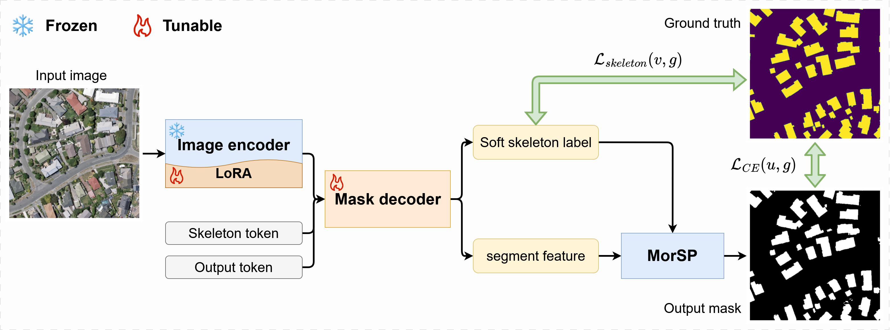
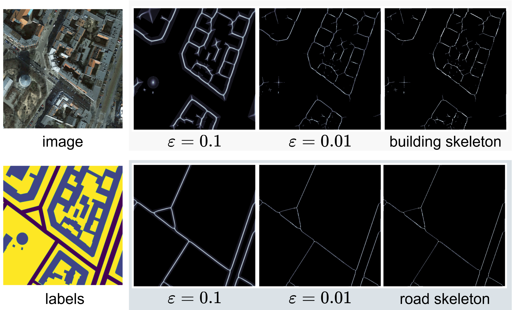

# SAM-MorSP - Official Implementation

This is the official code implementation of the paper:  
**"Slender Object Scene Segmentation in Remote Sensing Image Based on Learnable Morphological Skeleton With Segment Anything Model"**  
[[ArXiv Preprint](https://arxiv.org/abs/2411.08592)] 





## Installation

1. **Clone the repository**:
   ```bash
   git clone https://github.com/LeonelX/SAM-MorSP.git
   cd SAM-MorSP
   ```

2. **Set up Python environment** (Python 3.8+ recommended):
   ```bash
   conda create -n myconda python=3.12
   conda activate myconda
   pip install -r requirements.txt
   ```


### Training
To train the model:
```bash
chmod +x run.sh
bash run.sh -c configs/sam_base.py -t runs/train_task -g 0
```
Key arguments:
- `-c`: Path to config file
- `-t`: trainging task fold
- `-g`: GPU indexs

### Evaluation
To test the trained model:
```bash
python eval.py -c configs/sam_base.py -w runs/train_task/best
```

## Citation
If you use this code in your research, please cite our paper:
```bibtex
@article{xie2024slender,
  title={Slender Object Scene Segmentation in Remote Sensing Image Based on Learnable Morphological Skeleton with Segment Anything Model},
  author={Xie, Jun and Li, Wenxiao and Wang, Faqiang and Zhang, Liqiang and Hou, Zhengyang and Liu, Jun},
  journal={arXiv preprint arXiv:2411.08592},
  year={2024}
}
```
